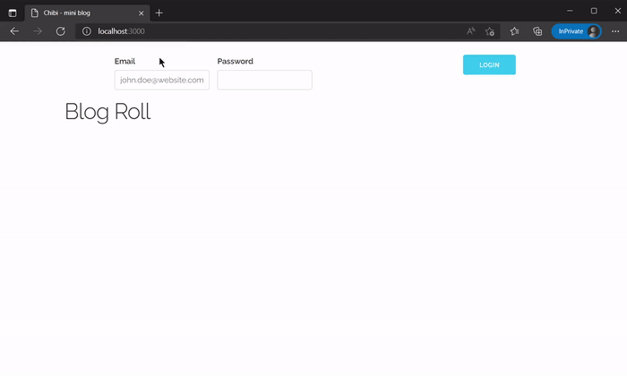

# Chibi

## Minimal blogging

### Environment

- React front end is intended to be hosted on S3 or behind Nginx as static files, uses NodeJS/NPM package manager to setup React development environment server
- Separate Flask backend handles REST routes and SQL, presents the data to React to view
- Uses SQLite3 for quick and easy setup

### Initial Setup

1. Git clone repo and cd into it
2. In one shell run the `env-setup` script from the server folder to setup virtual-env and download python packages
3. In another shell run `npm update` from the client folder to install dependencies for front end React development

### Development Setup

Both backend and front end development servers automatically refresh on file changes, speeding up development time.

- Client
    1. From the client folder, run `npm start` to begin client side React server
- Server
    1. Run `run-server` script found in the server folder, this will start the flask backend server in development mode

### Production Setup

- Client
    1. Change `config.json` in client folder to reflect the production backend server URI
    2. In client folder run `npm run build` to build out front end of site for static web server

- Server
    1. In server folder run `run-server` script, except change environment to `production`